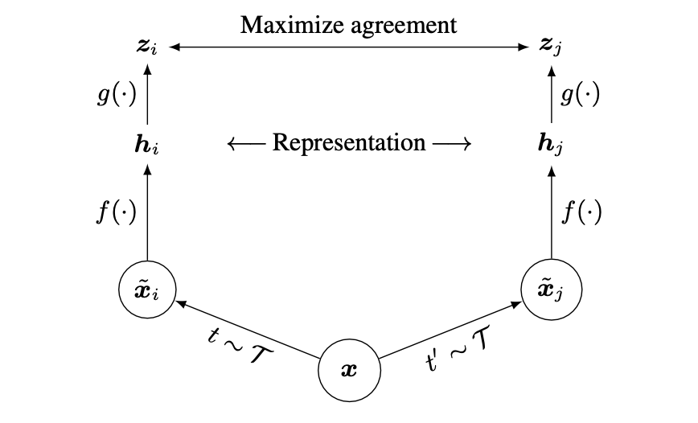

# SimCLR - An Unofficial Implementation for Anomaly Detection

## Overview
This project is an **unofficial implementation** of the paper [A Simple Framework for Contrastive Learning of Visual Representations (SimCLR)](https://arxiv.org/abs/2002.05709) applied to the **MVTec Anomaly Detection Dataset** ([MVTec AD Dataset](https://www.mvtec.com/company/research/datasets/mvtec-ad)). The implementation utilizes a **Siamese network** trained with **contrastive loss** to learn robust feature representations for anomaly detection.

## Architecture
The SimCLR framework consists of the following steps:
1. **Data Augmentation:** Each input image undergoes two different augmentations sampled from a predefined set of transformations.
2. **Feature Extraction:** A ResNet backbone extracts feature representations.
3. **Projection Head:** A small MLP projects the representations into a latent space.
4. **Contrastive Loss:** The model maximizes agreement between augmented views of the same image using a contrastive loss function.



## Supported Backbones
- ResNet-18
- ResNet-50 (default)
- ResNet-101

## Dataset Setup
Download the **MVTec Anomaly Detection Dataset** and place it in the same directory as the project.

## Training
To train the SimCLR model, run the following command:
```bash
python -m train.py
```

## Training Arguments
```python
if __name__ == "__main__":
    parser = argparse.ArgumentParser(description="Train a SimCLR model.")
    parser.add_argument("--data_dir", type=str, default="./dataset/mvtec", help="Path to dataset directory.")
    parser.add_argument("--resnet_size", type=int, default=50, choices=[18, 50, 101], help="Size of ResNet model.")
    parser.add_argument("--device", type=str, default="cuda", choices=["cuda", "cpu"], help="Device to train on.")
    parser.add_argument("--embedding_dim", type=int, default=64, help="Dimensionality of the embedding space.")
    parser.add_argument("--lr", type=float, default=0.01, help="Learning rate.")
    parser.add_argument("--weight_decay", type=float, default=0.0001, help="Weight decay for optimizer.")
    parser.add_argument("--step_size", type=int, default=5, help="Step size for LR scheduler.")
    parser.add_argument("--gamma", type=float, default=0.5, help="Gamma value for LR scheduler.")
    parser.add_argument("--save_checkpoints", type=int, default=5, help="Frequency (in epochs) to save checkpoints. Set to None to disable.")
    parser.add_argument("--num_epochs", type=int, default=40, help="Number of training epochs.")
    parser.add_argument("--resume_checkpoint", type=str, default=None, help="Path to a checkpoint to resume training from.")
    parser.add_argument("--optimizer_type", type=str, choices=["SGD", "Adam", "AdamW"], default="SGD", help="Training optimizer")
    parser.add_argument("--validationstep", type=int, default=5, help="Apply validation every validationstep")
    parser.add_argument("--use_scheduler", type=bool, default=True, help="True for learning rate scheduler")
    
    args = parser.parse_args()
    main(**vars(args))
```

## Requirements
Install the necessary dependencies using the following versions:
```bash
matplotlib==3.9.4
numpy==2.0.2
opencv-python==4.11.0.86
pandas==2.2.3
pillow==11.1.0
scikit-image==0.24.0
scikit-learn==1.6.1
scipy==1.13.1
torch==2.6.0+cu118
torchaudio==2.6.0+cu118
torchvision==0.21.0+cu118
```

## Citation
If you use this implementation, please cite the original SimCLR paper:
```
@article{chen2020simple,
  title={A Simple Framework for Contrastive Learning of Visual Representations},
  author={Chen, Ting and Kornblith, Simon and Norouzi, Mohammad and Hinton, Geoffrey},
  journal={arXiv preprint arXiv:2002.05709},
  year={2020}
}
```

This project is an unofficial implementation and is not affiliated with the original authors of SimCLR.

